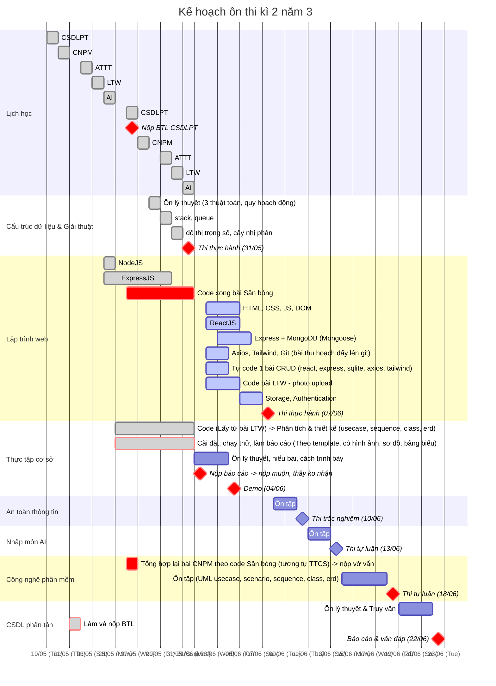

# cramming-plan
Kế hoạch ôn thi Kì 3 năm 2

## I. Gantt Chart kế hoạch ôn thi (tham khảo)

## II. Các chủ đề cần ôn

Học xong: 31/5

Học lại:

- Ctdl & gt -> thi thực hành (31/5)

Phải có code:

- lập trình web -> thi thực hành (7/6)
- csdl phân tán -> báo cáo btl, ko thi, vấn đáp (22/6)
- thực tập cơ sở -> chấm bài (4/6)

Ôn lý thuyết:

- cnpm -> thi tự luận, UML (18/6)
- attt -> trắc nghiệm (10/6)
- nhập môn AI -> tự luận (13/6)

### 1. Cấu trúc dữ liệu và giải thuật (31/5)

Note: tự ôn theo đề cương

3 thuật toán:

- quay lui liệt kê xâu nhị phân
- quay lui liệt kê tổ hợp
- quay lui liệt kê hoán vị

quy hoạch động

stack, queue

đồ thị trọng số, cây nhị phân

### 2. Lập trình web (7/6)

Note: chưa biết chi

HTML, CSS, JS, DOM, ReactJS, ExpressJS

ReactJS:

- ES6, JSX
- component, props, state
- event, lifecycle
- hooks, useState, useEffect
- input validation
- call API
- error handling
- crud with Restful API

Advanced:

- SPA
- Router v6
- nested routes
- dynamic routes
- protect routes

NodeJS:

- Chrome, V8 Engine, NodeJS
- node cli
- node http server

ExpressJS:

- routing
- parameter
- cors
- send data to server
- body parser
- package.json
- example: spotify, simple-blog

Authentication:

- stateful
- stateless

Storage:

- RDS
- ORM
- NoSQL - MongoDB
- example: simple-blog with MongoDB
- mongoose
- CRUD with MongoDB

phân tích yêu cầu bài LTW - photo upload (TH3 + final):
- kiến trúc tổng quan hệ thống và công nghệ sử dụng (FE, BE, DB)
- các thư viện sử dụng trong bài (vd kết nối BE -> DB dùng mongoose, gọi AIP từ FE -> BE dùng axios...)
- liệt kê các nhóm chức năng, và danh sách các chức năng cụ thể (vd nhóm user, gồm list user, get user detail..; nhóm upload, gồm...)
- sequence diagram (viết tóm tắt, ko cần vẽ cũng dc) theo MVC cho 1 vài usecase chính (vd list user, get user detail, cái nào model, cái nào view, cái nào controller...)

### 3. Cơ sở dữ liệu phân tán (22/6)

Note: chưa biết chi

Input:

- Slide tiếng việt
- Sách tham khảo tiếng anh

Biểu điểm:
- Kiểm tra giữa kì (10%) - rồi
- Bài tập nhóm (20%) - tgian nộp
- Thi cuối kì (60%)

Chủ đề:

- Định nghĩa
- Kiến trúc
- Điều khiển (view, materialized view, bảo mật, phân quyền, toàn vẹn dữ liệu, constraint)
- Truy vấn
- Giao dịch

### 4. Công nghệ phần mềm (18/6)

Note: biết sơ sơ, ko sâu

3 pha:

- phân tích
- thiết kế
- kiểm thử

Chủ đề:

- usecase
- scenario
- sequence
- class
- erd

### 5. Thực tập cơ sở (4/6)

Note: chưa làm dc chi

Điểm:

- tiến độ 30% -> phập phù
- báo cáo 40% -> cuối môn nộp
  - nêu vde
  - khảo sát, nghiên cứu, ứng dụng
  - phân tích, thiết kế (usecase, sequence, class, erd)
  - quá trình áp dụng, thực hiện (cài đặt, chạy thử)
  - trình bày khoa học, có đầu mục, hình ảnh, sơ đồ, bảng biểu
- demo 30% -> bảo vệ
  - chức năng, độ khó, workload
  - lưu loát, hiểu bài

### 6. Nhập môn trí tuệ nhân tạo (13/6)

Note: chưa biết chi, tạm bỏ qua, hên xui

Chủ đề:

- khái niệm, lịch sử hình thành phát triển
- giải quyết vấn đề bằng tìm kiếm
  - tìm kiếm mù
  - tìm kiếm có thông tin
  - tìm kiếm cục bộ
- biểu diễn tri thức
  - logic mệnh đề
  - logic vị từ cấp 1
- suy diễn xác suất
  - mạng Bayes
- học máy
  - cây quyết định
  - phân loại bayes đơn giản
  - học trên ví dụ
- AI có thể làm gì

### 7. An toàn thông tin (10/6)

Note: Trắc nghiệm, tạm bỏ qua, hên xui

Chủ đề:

- tổng quan
- tấn công và độc hại
- mã hóa
- kĩ thuật và công cụ attt
- quản lí, chính sách, pháp luật
- buffer overflow

